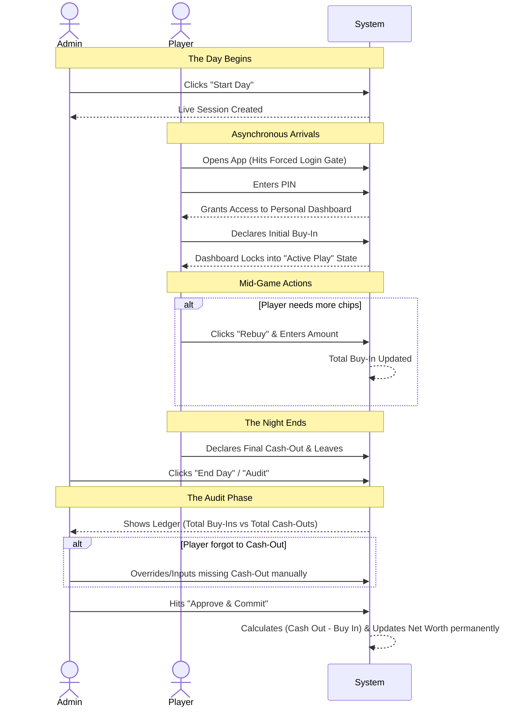
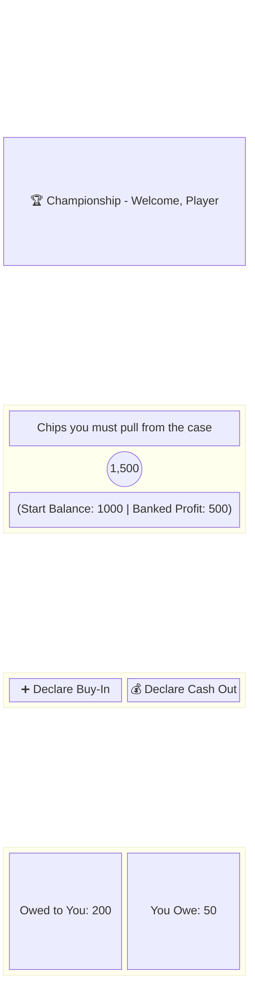

# Player Dashboard & Ledger Architecture

This document outlines the visual and technical flow for moving the Poker Championship app to a self-serve, asynchronous **Ledger System** with forced logins.

## 1. The Async Session Lifecycle

## 2. Personal Dashboard Wireframe Concept

## 3. Potential Pitfalls & Solutions

To ensure the system doesn't break down when it hits the real world, we've designed fail-safes for the most common human errors:

| Pitfall | Solution |
| :--- | :--- |
| **Players bypassing the math** | A **Forced Login Gate** ensures they cannot access the game without checking their dashboard first. |
| **Player forgets to Cash-Out** | The Admin acts as the ultimate auditor and can **manually override** or fill in missing cash-outs during the End Day review. |
| **Player needs a Rebuy** | The Dashboard will feature a dedicated **"Add Chips"** button that lets them safely add to their Daily Buy-In mid-game. |
